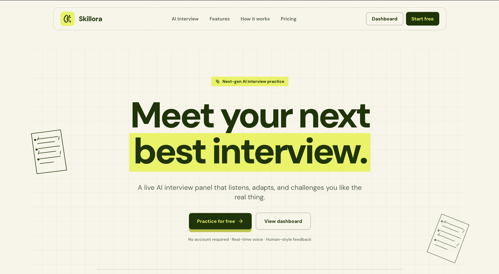
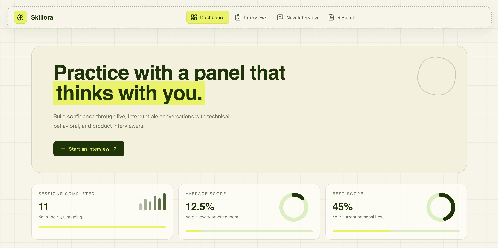
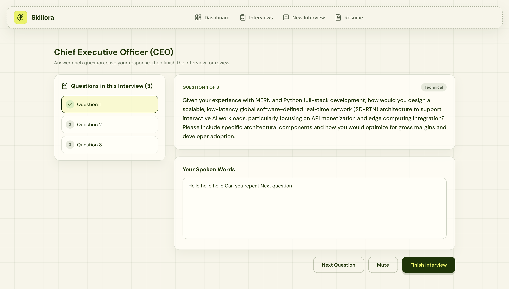

# Echosphere

**Live Demo:** [https://inter-we-u.netlify.app/](https://inter-we-u.netlify.app/)

Echosphere is a state-of-the-art AI-powered voice mock interview and career preparation platform. It leverages **Groq (Llama 3.3)** for context-aware RAG question generation and automated evaluation, and **Agora Conversational AI** for low-latency, real-time voice interaction.

---

## Overview

<div align="center">
  <h3>1. Real-Time AI Voice Interviewer</h3>
  
  <p><i>Live, natural spoken dialogue with an adaptive AI technical and behavioral interviewer using Agora WebRTC.</i></p>

  <br/>

  <h3>2. Context-Aware RAG & Question Generation</h3>
  
  <p><i>Smart resume parsing and semantic retrieval to generate role-tailored questions without hallucinations.</i></p>

  <br/>

  <h3>3. Comprehensive Performance Analytics</h3>
  
  <p><i>In-depth scorecards, keyword coverage analysis, strengths, weaknesses, and actionable feedback reports.</i></p>
</div>

---

## Key Features

- **Real-Time Voice AI Agent**: Conduct interactive, voice-based interviews with ultra-low latency powered by Agora Conversational AI.
- **RAG-Driven Question Synthesis**: Leverages LangChain and semantic chunking to ground interview questions strictly in candidate resumes and target job descriptions.
- **Adaptive Questioning & Probing**: Evaluates candidate responses in real-time, intelligently probing missing keywords or technical depth with targeted follow-ups.
- **Automated Scorecards & Feedback**: Instant grading with difficulty-calibrated metrics, category breakdowns, and hire/no-hire recommendations.
- **Smart Job Search & Query Parsing**: Real-time job discovery integrated with the Adzuna API and LLM-powered natural language search filtering.
- **Admin Dynamic Prompt Management**: Full control over system prompt templates, versioning, and self-healing baseline seeders.

---

## Live Voice Interview Architecture & Adaptive Evaluation

Echosphere replicates the rigor of real-world technical and behavioral interviews through an end-to-end automated pipeline:

1. **Candidate Context Ingestion**: Candidates upload their resume and target job profile. The RAG engine chunks and indexes key technical competencies, projects, and domain experience.
2. **Real-Time Voice Loop**: Candidates connect to an Agora WebRTC channel where the AI agent speaks, listens, and responds naturally, adapting to clarification requests and pauses.
3. **Calibrated Evaluation**: Responses are transcribed and scored against expected technical keywords and clarity benchmarks, generating detailed post-interview analytics to accelerate career growth.

---

## Tech Stack

- **Frontend**: React 18, Vite, Tailwind CSS, Framer Motion, Zustand, Agora RTC SDK
- **Backend**: Node.js, Express.js, MongoDB Atlas (Mongoose), Socket.io, Cloudinary, Redis
- **AI / Real-Time Voice**: Groq SDK (`llama-3.3-70b-versatile`), Agora Conversational AI Agent REST API v2, LangChain, OpenAI Embeddings

---

## Getting Started

### 1. Environment Configuration

Create a `.env` file in the **backend** directory:
```env
PORT=5000
NODE_ENV=development
CLIENT_URL=http://localhost:5173

# Database
MONGO_URI=your_mongodb_connection_string

# Authentication
JWT_SECRET=your_jwt_secret
JWT_REFRESH_SECRET=your_jwt_refresh_secret

# AI & LLM (Groq)
GROQ_API_KEY=your_groq_api_key

# Agora Conversational AI & WebRTC
AGORA_APP_ID=your_agora_app_id
AGORA_APP_CERTIFICATE=your_agora_app_certificate
AGORA_CUSTOMER_ID=your_agora_customer_id
AGORA_CUSTOMER_SECRET=your_agora_customer_secret
AGORA_PIPELINE_ID=your_agora_pipeline_id

# Cloudinary (Resume Storage)
CLOUDINARY_CLOUD_NAME=your_cloudinary_cloud_name
CLOUDINARY_API_KEY=your_cloudinary_api_key
CLOUDINARY_API_SECRET=your_cloudinary_api_secret

# Job Search (Optional)
ADZUNA_APP_ID=your_adzuna_app_id
ADZUNA_APP_KEY=your_adzuna_app_key
```

Create a `.env` file in the **frontend** directory:
```env
VITE_API_URL=http://localhost:5000/api
VITE_APP_NAME=Echosphere
```

### 2. Backend Installation

```bash
cd backend
npm install
npm run dev
```

### 3. Frontend Installation

```bash
cd frontend
npm install
npm run dev
```

---

